[⬅ Main Page](https://github.com/e4jet/dsop)

# Orchestrator Basics

## [Video Link ⬈](https://www.youtube.com/watch?v=f9931oXjGb0)

## Description

An orchestrator, or more formally a Container Orchestration system, allows users to declare their intended state and then works to implement it. Examples of Container Orchestration systems include Swarm, Kubernetes, and Marathon, but there are others. In this episode we take a look at orchestrators generically and explore how shared persistent volumes can provide an application with state.

## Agenda

* Container Orchestration system overview and examples
* Container Orchestration system availability benefit
* Storage volumes can be used to store application state
* Availability with regard to containers with storage volumes
* Storage Access Modes

## Declarative

---

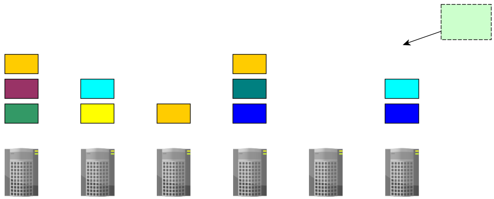

---

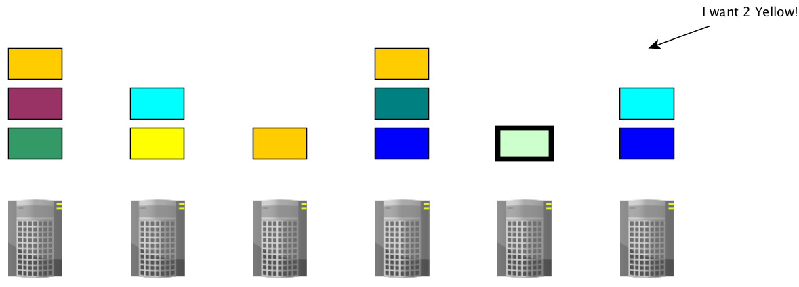

---

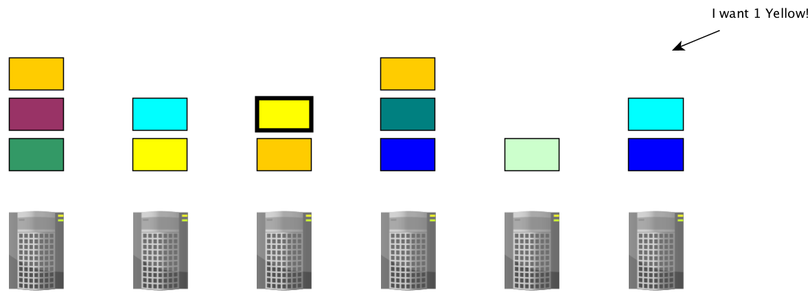

---

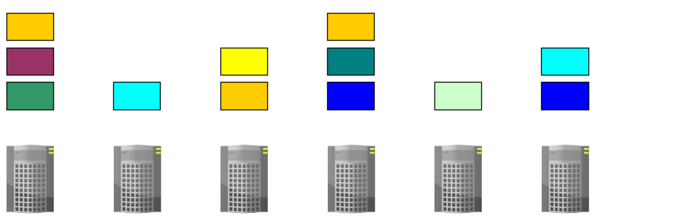

---

## Availability

---

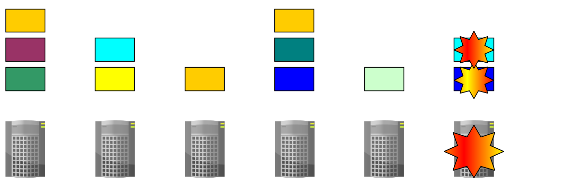

---

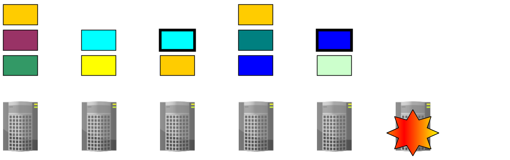

---

## Declarative With State

---

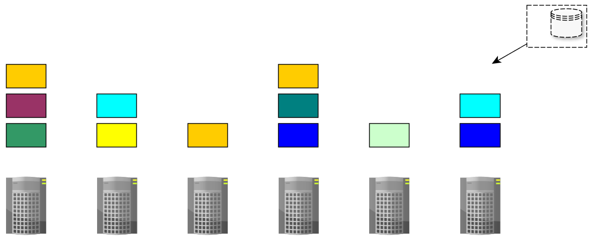

---

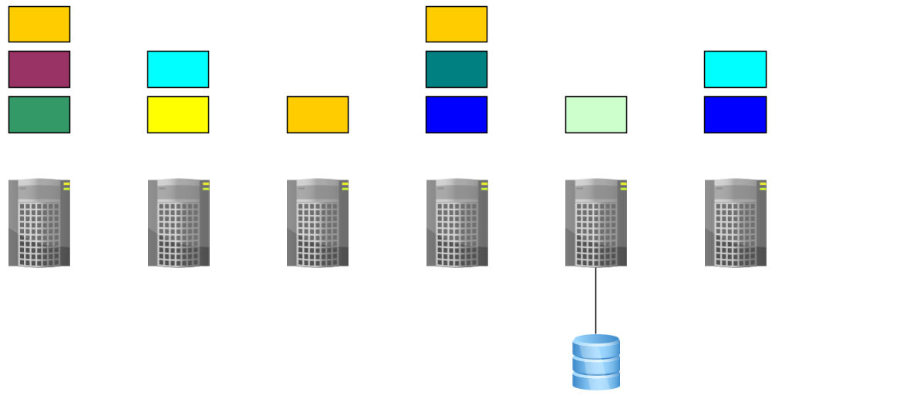

---

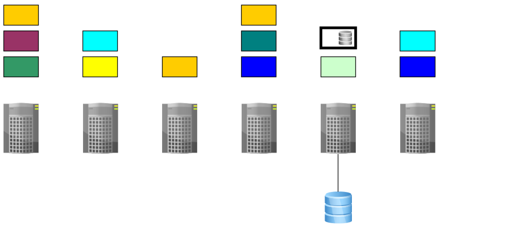

## Availability With Storage Volumes

---

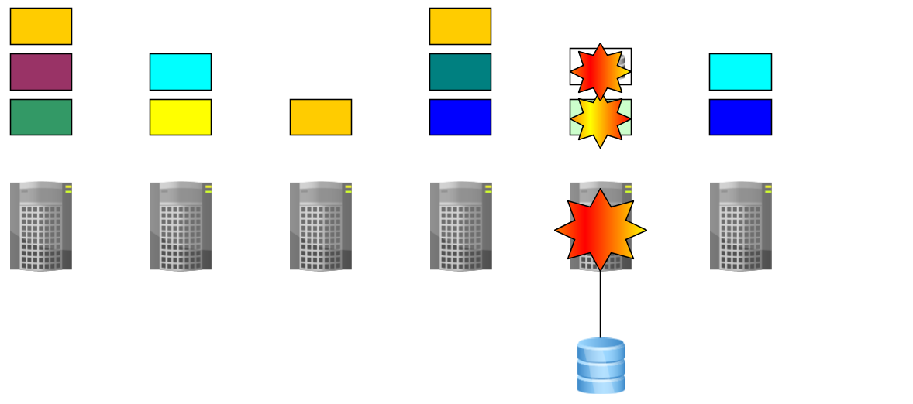

---

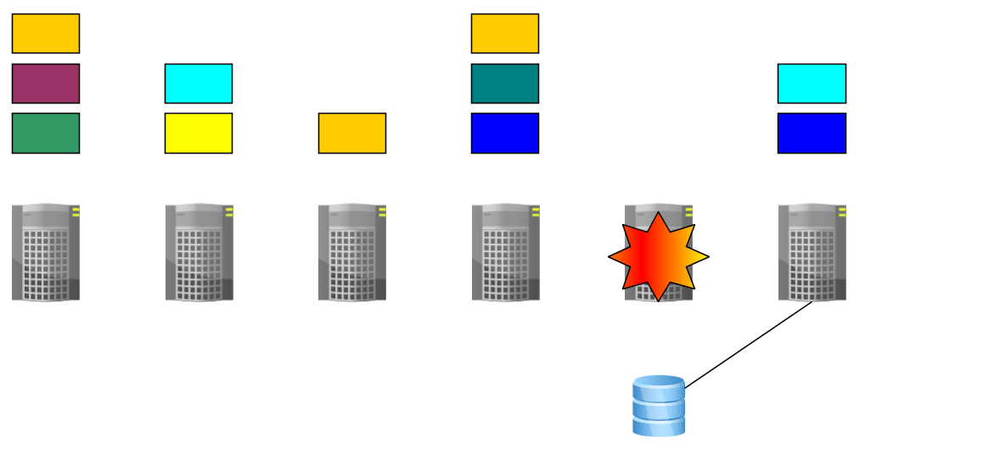

---

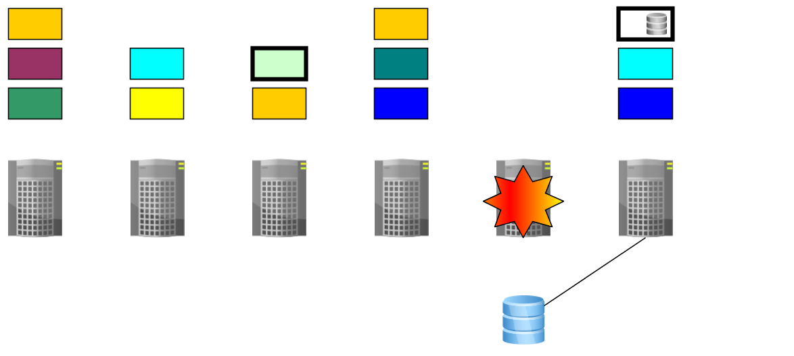

## Access Modes: Multiple Containers Sharing Storage Volumes

---

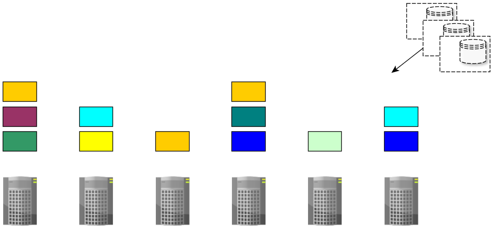

---

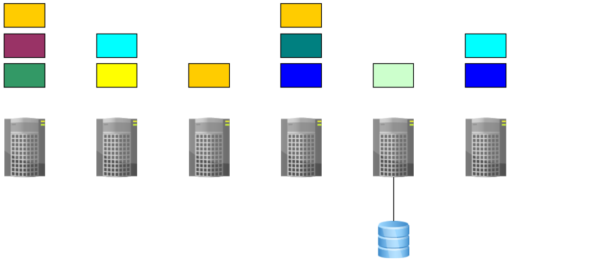

---

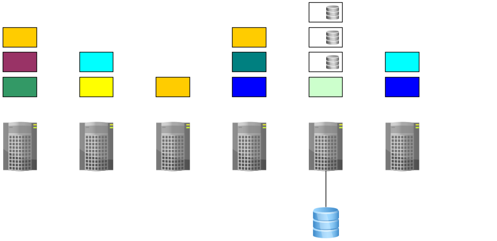

---

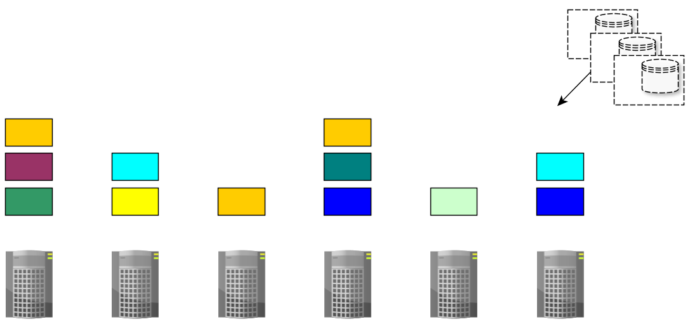

---

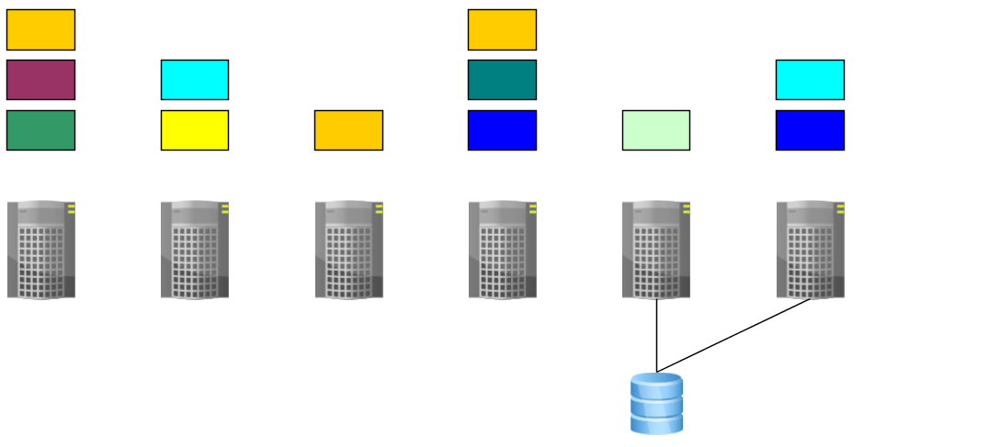

---

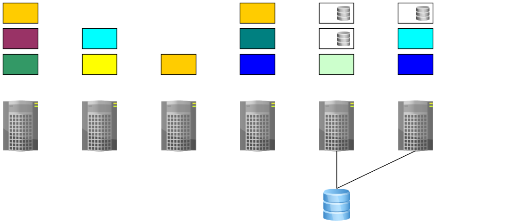

---

# Thank you