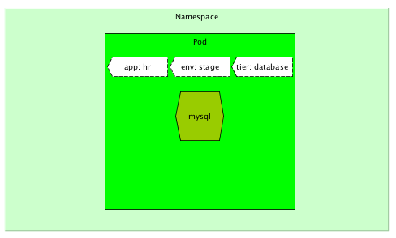
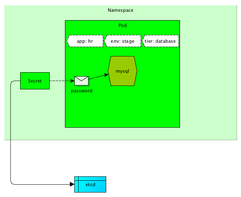
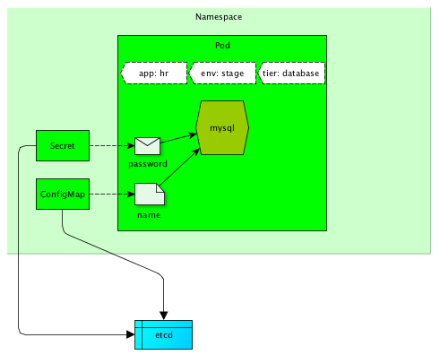
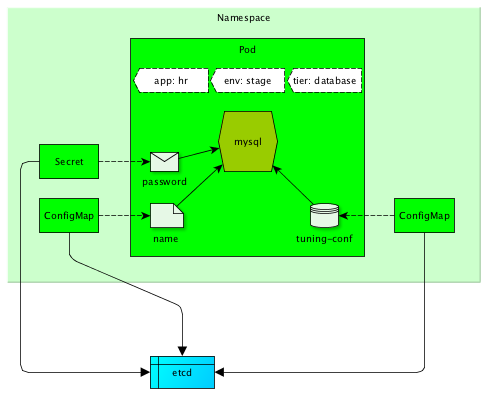
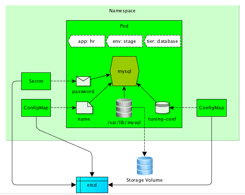

[⬅ Main Page](https://github.com/e4jet/dsop)

# Episode 2: Introduction to Volumes in Kubernetes

## [Video Link ⬈](https://www.youtube.com/playlist?list=PL-xGSXoxFBMehf1oX1JyLel9_bl5LUmxH)

## Description

The goal of this episode was to cover some of the basic concepts needed to start to take advantage of Kubernetes for stateful applications. This turned out to be a little too ambitious given the constraint I placed on the video length. As a compromise, I decide to release this episode in 4 "chapters" (videos). The link above is to a Playlist that includes all 4 videos. Below are links to the individual videos.

The example in each of the chapters builds on the previous one.  The first chapter (2.0) provides an overview of the concepts. The second chapter (2.1) demonstrates an ephemeral Pod. The third chapter (2.2) shows how to use Secrets and ConfigMaps. The final chapter (2.3) introduces a Storage Volume and demonstrates how application state can be preserved.

The links and images used in the videos are available below. I've added links to two Volume related vulnerabilities in Kubernetes as well. Both have been resolved. I point them out only because they have been resolved recently, so you may want to check to see if you're running an effected version.

## Links

* [Kubernetes Documentation: Pod](https://kubernetes.io/docs/concepts/workloads/pods/pod/)
* [Kubernetes Documentation: Storage Volumes](https://kubernetes.io/docs/concepts/storage/volumes/)
* [Kubernetes Documentation: Namespace](https://kubernetes.io/docs/concepts/overview/working-with-objects/namespaces/)
* [Kubernetes Documentation: Secret](https://kubernetes.io/docs/concepts/configuration/secret/)
* [Kubernetes Documentation: ConfigMap](https://kubernetes.io/docs/tasks/configure-pod-container/configure-pod-configmap/)
* [MySQL Image](https://hub.docker.com/_/mysql/)
* [Project Dory](https://github.com/hpe-storage/dory)
* [Issue: Subpath volume mount handling allows arbitrary file access in host filesystem](https://github.com/kubernetes/kubernetes/issues/60813)
* [Issue: Atomic writer volume handling allows arbitrary file deletion in host filesystem](https://github.com/kubernetes/kubernetes/issues/60814)

## Chapters

### Chapter 2.0 - Overview of Episode 2

[Video Link ⬈](https://www.youtube.com/watch?v=vvLH_G__EOU&index=1&list=PL-xGSXoxFBMehf1oX1JyLel9_bl5LUmxH)

### Chapter 2.1

[Video Link ⬈](https://www.youtube.com/watch?v=sqlEc8NndnI&index=2&list=PL-xGSXoxFBMehf1oX1JyLel9_bl5LUmxH)

#### Stage 1 - Basic Pod

### Chapter 2.2

[Video Link ⬈](https://www.youtube.com/watch?v=mbjVezAzmPQ&index=3&list=PL-xGSXoxFBMehf1oX1JyLel9_bl5LUmxH)

### Stage 2 - Secret

### Stage 3 - ConfigMap (ENV)

### Stage 4 - ConfigMap (File)

### Chapter 2.3

[Video Link ⬈](https://www.youtube.com/watch?v=6bPPUzuKLEA&list=PL-xGSXoxFBMehf1oX1JyLel9_bl5LUmx)

### Stage 5 - Storage Volume

