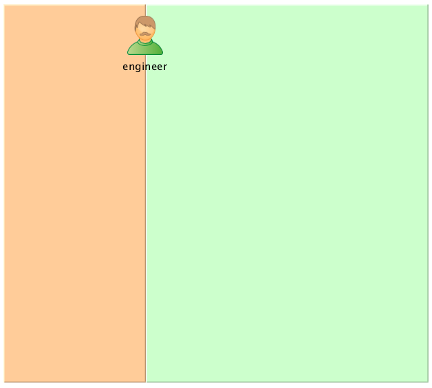
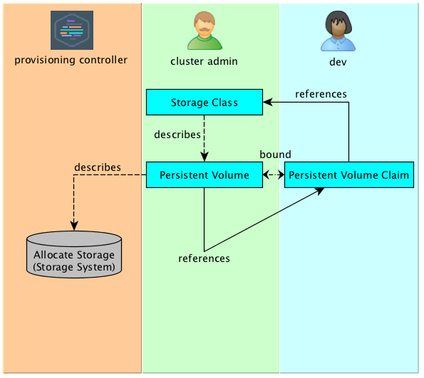

[⬅ Main Page](https://github.com/e4jet/dsop)

# Episode 3: Storage Provisioning in Kubernetes

## [Video Link ⬈](https://www.youtube.com/watch?v=BM_QyqnRsMg)

## Description

Provide an overview of the following:

* __Volume Provisioning (Direct Volume Reference)__
  * Simple and Easy to Manage, especially for an IT Generalist
  * Tightly couples the Pod or Pod Template to a cluster implementation
  * Opaque with regard to the cluster itself (ie: no way to list volumes using kubectl)
* __Persistent Volume Provisioning__
  * Introduces a Layer of Abstraction using 2 objects
    * Persistent Volume - describes storage
    * Persistent Volume Claim - reserves a Persistent Volume
  * Decouples Pod and Pod Templates from the cluster implementation
* __Dynamic Persistent Volume Provisioning (Dynamic Volume Provisioning)__
  * Policy Based Storage Management
  * Self Service Provisioning

## Links

* [Kubernetes Documentation: Storage](https://kubernetes.io/docs/concepts/storage/)
* [Project Dory](https://github.com/hpe-storage/dory)

## Diagrams

### Volume Provisioning (Direct Volume Reference)

#### Manual Provisioning

#### Automatic Provisioning using Dory

### Persistent Volume Provisioning

#### Manual Pre-provisioning

#### Demand based Manual Provisioning

#### Just In Time Provisioning using Dory

### Dynamic Persistent Volume Provisioning (Dynamic Volume Provisioning)

